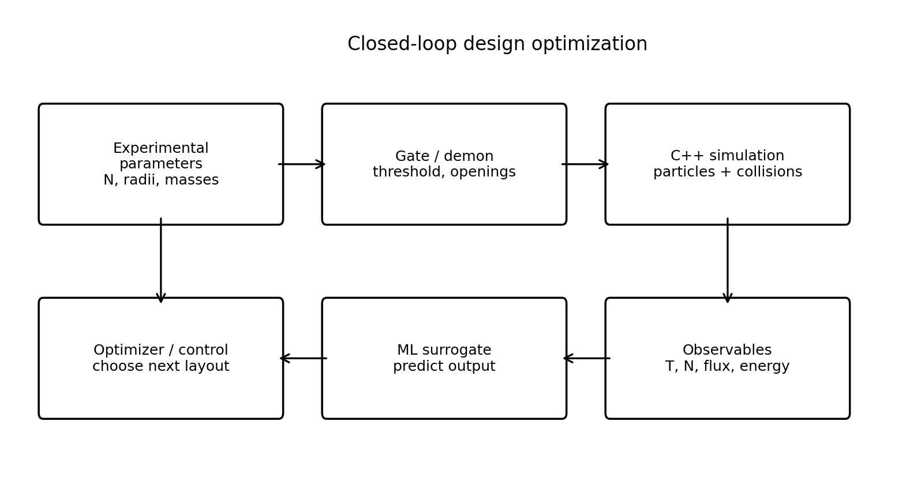
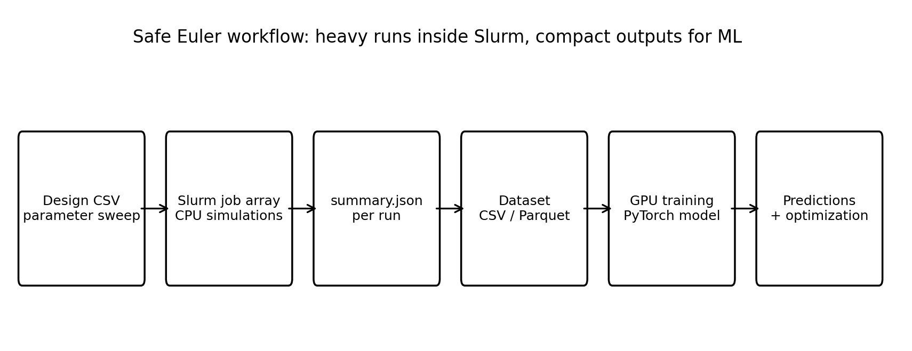

# Maxwell Demon complete repo


C++17 Maxwell-demon-style hard-disk gas simulator + Python visualization + Euler Slurm sweeps + GPU ML surrogate training.

The repo is split conceptually into:

```text
src/, include/      C++ simulator core
simulation/        local ready-to-run configs and helper scripts
scripts/           visualization, design generation, control diagrams
euler/             Slurm scripts for CPU sweeps and GPU training
ml/                dataset building, PyTorch training, prediction, optimization
designs/           CSV design tables for many configurations
config/            older/basic example configs
```

## 1. Local simulation with GIF

```bash
python3 -m venv .venv
source .venv/bin/activate
pip install -r requirements.txt
bash simulation/run_local_demo.sh
```

Outputs:

```text
output/local_demo_separation/separation.gif
output/local_demo_separation/diagnostics_temperature.png
output/local_demo_separation/diagnostics_final_snapshot.png
output/local_demo_separation/observables.csv
output/local_demo_separation/summary.json
```

The GIF overlay and `observables.csv` include live chamber-temperature statistics:

```text
temperature_left
temperature_right
temperature_contrast
n_left
n_right
separation_score
```

For a live plot while the run is still writing `observables.csv`:

```bash
python3 scripts/live_temperature_plot.py output/local_demo_separation --poll 1.0
```

For a larger local run without heavy snapshots:

```bash
bash simulation/run_big_local.sh
```

For two particle populations:

```bash
bash simulation/run_two_species_demo.sh
```

## 2. Temperature definition

For each chamber the simulator computes a 2D kinetic temperature with `k_B = 1` after subtracting the chamber center-of-mass velocity:

```text
T_chamber = thermal_kinetic_energy_chamber / N_chamber
```

This is written every `observable_interval` steps in `observables.csv`. Set this in configs to print live telemetry to the console:

```text
live_log_interval = 400
```

Thermal equilibrium and separated steady state are deliberately separate flags:

```text
thermal_equilibrium_reached
steady_state_reached
separated_steady_state_reached
```

A separated Maxwell-demon state is not automatically thermal equilibrium.

## 3. Change number/type of balls in config

One species:

```text
species_count = 1
species0_count = 120
species0_radius = 0.12
species0_mass = 1.0
species0_friction_gamma = 0.0
species0_drive_strength = 0.0
```

Two species:

```text
species_count = 2
species0_count = 700
species0_radius = 0.08
species0_mass = 1.0
species0_friction_gamma = 0.0
species0_drive_strength = 0.0
species1_count = 300
species1_radius = 0.13
species1_mass = 2.5
species1_friction_gamma = 0.0
species1_drive_strength = 0.0
```

Other important controls:

```text
lx, ly                         box size
middle_wall_x                  wall location
opening_centers, opening_height gate geometry
demon_threshold, demon_mode     gate rule
friction_gamma, drive_strength  dissipation / energy input
snapshot_interval               0 disables snapshots.csv for large runs
observable_interval             temperature/statistics sampling interval
```

## 4. Manual build/run

```bash
cmake -S . -B build -DCMAKE_BUILD_TYPE=Release
cmake --build build -j
./build/maxwell_demon_sim simulation/configs/local_demo_separation.cfg
python3 scripts/plots.py output/local_demo_separation --save-prefix output/local_demo_separation/diagnostics
python3 scripts/animate.py output/local_demo_separation --save-gif output/local_demo_separation/separation.gif --max-frames 320 --fps 20
```

## 5. Euler CPU sweeps

On Euler, use Slurm. Do not run large sweeps on login nodes.

```bash
bash euler/check_resources.sh | tee euler_resource_report.txt
sbatch euler/build_cpu.sbatch
bash euler/start_cpu_sweep.sh 64 euler_medium 16 0
```

After the pilot is good:

```bash
bash euler/start_cpu_sweep.sh 2000 euler_medium 128 0
```

The last argument is `snapshot_interval`. Keep it `0` for dataset generation.

Collect compact summaries into a dataset:

```bash
bash euler/collect_for_job.sh <array_job_id> designs/design.csv
```

## 6. Euler GPU ML training

```bash
bash euler/setup_python_venv.sh $HOME/venvs/maxwell_demon
source $HOME/venvs/maxwell_demon/bin/activate
pip install -r requirements-ml-gpu.txt
bash euler/start_gpu_training.sh output/datasets/maxwell_dataset.parquet
```

## 7. Prediction and optimization

```bash
python3 ml/predict.py \
  --model output/models/surrogate.pt \
  --input designs/design.csv \
  --out output/predictions/design_predictions.csv

python3 ml/optimize_layout.py \
  --model output/models/surrogate.pt \
  --out output/predictions/top_candidates.csv \
  --trials 10000 \
  --top-k 50
```

Then re-run the best candidates with the C++ simulator and compare predicted vs simulated outputs.

## 8. Control/block diagrams

```bash
python3 scripts/block_diagrams.py --out-dir output/figures
```

Outputs:

```text
output/figures/control_loop.png
output/figures/euler_pipeline.png
```






